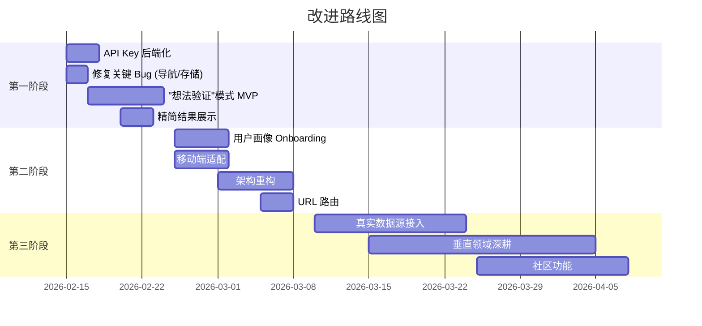

# AutoWealth Scout AI — 产品改进方案

> 本文档包含产品层面和技术层面的系统性改进规划，分为三个阶段执行。

---

## 第一阶段：基础修复与核心转型 (1-2 周)

### 🔴 产品核心转型：从"发现机会"到"验证想法"

**现状问题**：当前产品输出 10 个行业 → 10 个细分 → 10 个机会，本质与搜索引擎/ChatGPT 无差异，用户信任度低、留存差。

**改进方向**：

#### 1. 新增"想法验证"模式
- 用户输入一个具体的商业想法（如"小红书代运营"）
- 系统输出结构化验证报告：
  - **市场规模**：通过 Google Trends 数据展示搜索热度趋势
  - **竞争分析**：实际竞品数量、头部玩家、进入壁垒
  - **成本估算**：启动资金、时间投入、技能要求
  - **盈利路径**：真实的变现方式与客单价范围
  - **风险评估**：常见失败原因、市场饱和度

#### 2. 精简结果数量，提升质量
- 从"10 个泛泛机会"改为"3 个精选推荐"
- 每个推荐附带 **可信度评分** 和 **数据来源引用**
- 展示 Google Search Grounding 返回的真实来源链接（当前已获取但未充分展示）

#### 3. "第一步行动" 替代 "10 步行动计划"
- 每个机会只给出 **今天就能做的 1 件事**
- 附带直达链接（如：注册 Shopify → 直链到 Shopify 注册页）
- 提供可下载的文案模板/定价模板（而非不可运行的代码）

### 🔴 关键技术修复

| 修复项 | 说明 |
|--------|------|
| API Key 安全 | 搭建后端代理，移除前端 API Key 暴露 |
| 移除 import map | 删除 `index.html` 中的 `importmap`，避免与 Vite 冲突 |
| 修复返回导航 | "返回上一级"时恢复对应层级的数据 |
| localStorage 同步 | 添加 `useEffect` 将 `savedAgents` 写回 localStorage |
| 删除无用 CSS 引用 | 移除 `index.html` 中对不存在的 `index.css` 的引用 |

---

## 第二阶段：用户体验升级 (2-4 周)

### 🟡 个性化画像系统

取代当前粗糙的 7 个筛选器标签，改为 **首次使用时的 4 步Onboarding**：

```
Step 1: 你的可用时间？ → 全职 / 每天3小时 / 周末
Step 2: 你的技能背景？ → 编程 / 设计 / 写作 / 营销 / 无特殊技能
Step 3: 你的启动预算？ → ¥0 / ¥1000以内 / ¥5000以上
Step 4: 你的兴趣领域？ → 电商 / 内容创作 / SaaS / 教育 / 自由选择
```

将用户画像存入 localStorage，后续所有 AI 请求都携带这些上下文，使结果真正个性化。

### 🟡 UI/UX 改进

- **骨架屏加载**：替代空白等待状态，提升感知速度
- **移动端适配**：
  - 侧边栏终端改为可折叠抽屉
  - 添加底部 Tab 导航
  - 优化 Modal 在小屏的双栏布局
- **利用 TrendChart**：
  - 将已实现的 Recharts 图表嵌入结果页
  - 在侧边栏展示机会对比雷达图
- **URL 路由**：引入 `react-router`，支持刷新不丢状态、可分享链接

### 🟡 架构重构

- 拆分 `App.tsx` (330 行) → `hooks/useDiscovery.ts` + `pages/ScoutPage.tsx` + `layouts/MainLayout.tsx`
- 统一 i18n 系统：将 7 个文件中的翻译集中到 `i18n/translations.ts`
- Gemini 客户端单例化：避免每次 API 调用重复实例化
- 添加 React Error Boundary

---

## 第三阶段：差异化与壁垒构建 (1-3 月)

### 🟢 真实数据集成

- **Google Trends API**：展示关键词搜索趋势曲线
- **社交媒体验证**：接入 Twitter/Reddit/小红书的讨论热度
- **竞品数量**：通过搜索引擎估算同类产品/服务数量

### 🟢 垂直领域深耕

建议选择 **一个** 垂直领域做深，而非全品类扫描：

| 候选方向 | 优势 | 可行性 |
|----------|------|--------|
| YouTube/短视频 | 数据可获取、用户群大 | ⭐⭐⭐⭐ |
| 跨境电商选品 | 高付费意愿、数据丰富 | ⭐⭐⭐ |
| AI 工具/SaaS | 与技术栈契合 | ⭐⭐⭐⭐⭐ |
| 自由职业/接单 | 新手友好、市场大 | ⭐⭐⭐⭐ |

### 🟢 社区与信任

- 接入真实案例（Reddit/即刻/Twitter 创业分享帖）
- 展示真实用户的执行进度和收入报告
- 建立"已验证"标签体系

### 🟢 代码沙箱升级

将当前的模拟运行替换为真实执行环境：
- 集成 [WebContainers](https://webcontainers.io/) 或 [Sandpack](https://sandpack.codesandbox.io/)
- 或改为生成 **工作流模板**（Zapier/Make.com 可直接导入的 JSON）

---

## 成功指标

| 指标 | 当前预估 | 第一阶段目标 |
|------|---------|-------------|
| 用户首次停留时长 | ~2 分钟 | 5+ 分钟 |
| 从"浏览"到"深入查看"转化率 | ~30% | 60%+ |
| 7 日留存率 | ~5% | 20%+ |
| 用户主动输入想法 | 很少 | 50%+ 的会话 |

---

## 技术路线图总结


